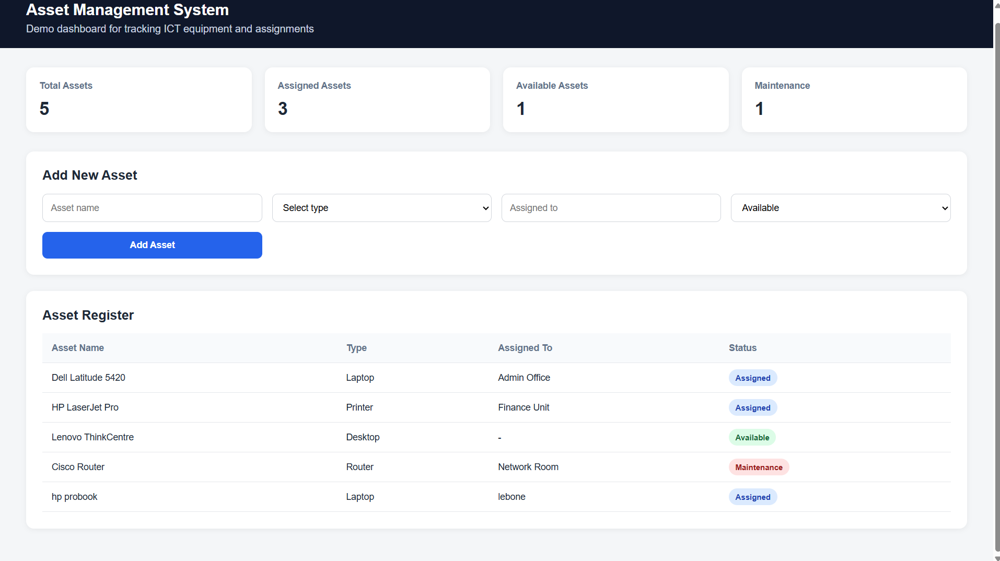

# Asset Management System (Demo)

## Overview
A simple asset management system that simulates the tracking and management of ICT equipment such as laptops, printers, and other devices.

## Purpose
This project demonstrates my ability to design and develop structured, real-world applications focused on system organization and usability.

## Features
- Dashboard overview of assets
- Add and register new assets
- Assign assets to users
- View asset status
- Basic asset tracking

## Technologies
- PHP
- HTML
- MySQL
- JavaScript
- CSS

## Screenshots

## Note
This is a demo project created for portfolio purposes only. No real or sensitive data is used.
